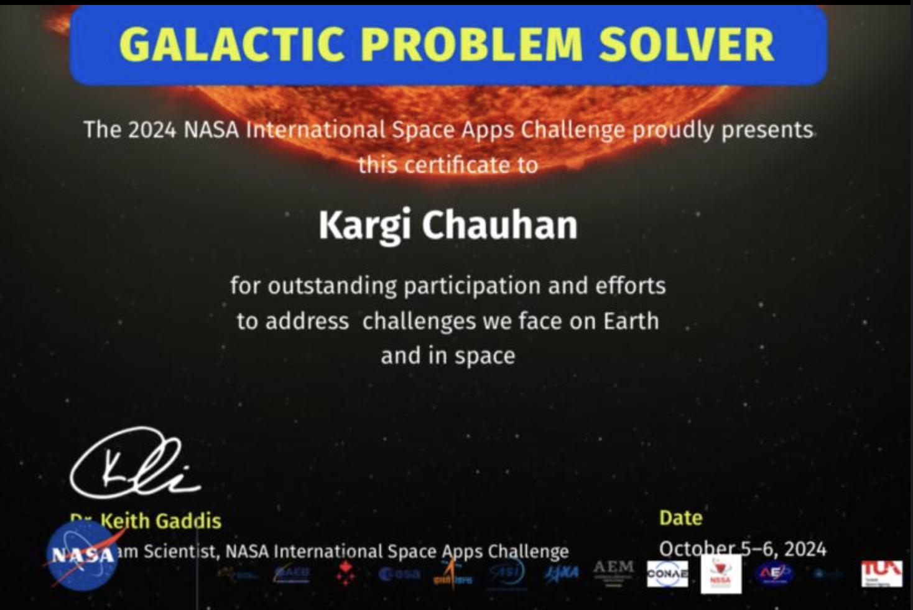
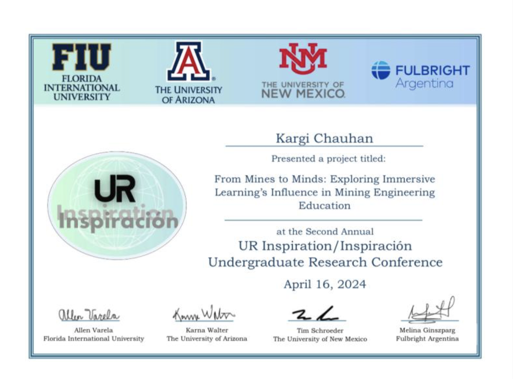
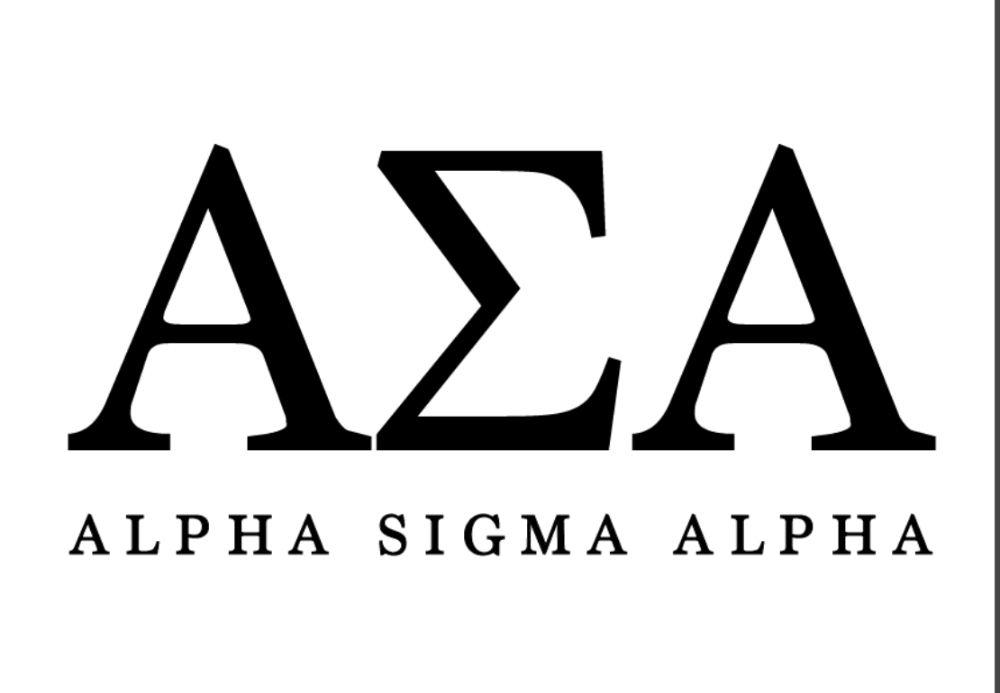
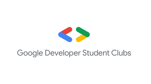
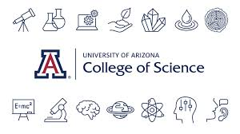
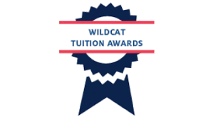
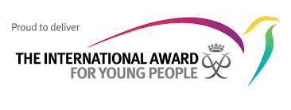
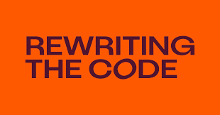



### NASA AMES
{: style="width: 100%; max-height: 250px; object-fit: cover; border-radius: 5px;"}  

Recognized as a Galactic Problem Solver for my outstanding contributions in the 2024 NASA International Space Apps Challenge.

---

### Undergrad Research
{: style="width: 100%; max-height: 250px; object-fit: cover; border-radius: 5px;"}  

Presented my project "From Mines to Minds" at the UR Inspiration Undergraduate Research Conference, focusing on immersive learning in mining engineering education.

---

### Alpha Sigma Alpha
{: style="width: 100%; max-height: 250px; object-fit: cover; border-radius: 5px;"}  
 
Member of Alpha Sigma Alpha since January 2023, actively contributing to leadership, sisterhood, and community service at the University of Arizona.

---

### Google Developer Student Club
{: style="width: 100%; max-height: 250px; object-fit: cover; border-radius: 5px;"}  

As part of the e-board, I played a key role in organizing events, leading workshops, and fostering collaboration using Google technologies.

---

### Dean's List
{: style="width: 100%; max-height: 250px; object-fit: cover; border-radius: 5px;"}  

I was honored to be on the Dean's List for four consecutive years, demonstrating my commitment to academic excellence.

---

### Scholarship
{: style="width: 100%; max-height: 250px; object-fit: cover; border-radius: 5px;"}  

I received the Global Wildcat Scholarship, covering 100% of my tuition. I also applied for the notable Galileo Circle Scholars program.

---

### The International Award for Young People
{: style="width: 100%; max-height: 250px; object-fit: cover; border-radius: 5px;"}  
 
A global program fostering personal growth and leadership. As a Gold Award recipient, I demonstrated dedication and community impact.

---

### TOI Women Soccer Lead
{: style="width: 100%; max-height: 250px; object-fit: cover; border-radius: 5px;"}  

For three years, I had the privilege of leading and playing alongside multiple teams at the national and international levels. My journey as a player has been filled with thrilling experiences, from intense matches to memorable victories.

---

### Rewrite the Code
{: style="width: 100%; max-height: 250px; object-fit: cover; border-radius: 5px;"}  

I have been part of the community team for three years, supporting women in tech and fostering an inclusive environment.
