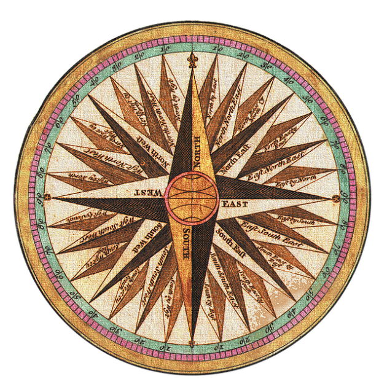



======

## Beyond Stars

**Beyond Stars** is an interactive web app that lets users explore the night sky as seen from exoplanets. Using data from NASA's Gaia star catalog, the app provides a unique 3D view of stars and constellations from various exoplanetary perspectives. It also features an educational gaming mode to engage users in discovering celestial objects.

### Tech Stack
- **Languages:** Python, JavaScript, HTML/CSS
- **Frameworks & Libraries:** Three.js, WebGL
- **Tools:** Figma (for UI/UX design)
- **Data Source:** ESA Gaia DR3 Star Catalog

  <a href="https://github.com/Kargichauhan/beyondthestars" style="padding: 10px 20px; background-color: #7d8085; color: white; text-decoration: none; border-radius: 5px; text-align: center; font-weight: bold; flex: 1;">GitHub</a>
  <a href="https://beyondstars.space" style="padding: 10px 20px; background-color: #7d8085; color: white; text-decoration: none; border-radius: 5px; text-align: center; font-weight: bold; flex: 1;">Website</a>
  <a href="https://www.canva.com/design/DAGSyNAtv2Q/10FhJ-Qr4NBaI6PKU76vDg/view" style="padding: 10px 20px; background-color: #7d8085; color: white; text-decoration: none; border-radius: 5px; text-align: center; font-weight: bold; flex: 1;">Demo</a>

---

## UA Course Compass

**UA Course Compass** is a web-based software application designed to help students pursuing a Bachelor of Science in Information Science at the University of Arizona effectively manage their 4-year course plan. The platform provides personalized course recommendations, a four-year planning tool, interest surveys, and email reminders to streamline the academic planning process, leveraging machine learning and data scraping technologies to enhance the student experience.

### Tech Stack
- **Languages:** HTML, CSS, JavaScript
- **Frameworks & Libraries:** Node.js, Selenium
- **Database:** PostgreSQL
- **Machine Learning:** NLP algorithm for course recommendations
- **Other Tools:** Email API for notifications, Data scraping from university course catalogs

  <a href="https://github.com/rachelS485/ISTA-498-Capstone-Group-1" style="padding: 10px 20px; background-color: #7d8085; color: white; text-decoration: none; border-radius: 5px; text-align: center; font-weight: bold; flex: 1;">GitHub</a>
  <a href="https://www.canva.com/design/DAGDLihHpOY/iQS9LNLp3uMDeqHJTggxOw/view" style="padding: 10px 20px; background-color: #7d8085; color: white; text-decoration: none; border-radius: 5px; text-align: center; font-weight: bold; flex: 1;">Demo</a>

---

## Autonomous Deep Space Exploration

This project focuses on enabling deep space exploration using innovative system-of-systems architecture with small spacecraft inspectors. Leveraging machine learning for real-time decision-making, the project addresses the challenges of long-duration space missions, including navigation and communication limitations in harsh environments.

### Tech Stack
- **Languages:** Python
- **Frameworks:** Machine Learning Algorithms for autonomous operation
- **Tools:** Synthetic Data Generation, Hyperparameter Tuning
- **System Architecture:** Multi-layered inspector satellite design

  <a href="https://github.com/Kargichauhan/ml-main" style="padding: 10px 20px; background-color: #7d8085; color: white; text-decoration: none; border-radius: 5px; text-align: center; font-weight: bold; flex: 1;">GitHub</a>
  <a href="https://pdf.ac/220KBn" style="padding: 10px 20px; background-color: #7d8085; color: white; text-decoration: none; border-radius: 5px; text-align: center; font-weight: bold; flex: 1;">Demo</a>

---

## Linear Regression and Cross Validation

This project focuses on implementing linear regression using matrix normal equations and performing cross-validation to assess model performance. The objective is to fit polynomial models to datasets and interpret regression outcomes. Python is used for building regression models, generating cross-validation results, and producing plots for data visualization.

### Tech Stack
- **Languages:** Python
- **Libraries:** NumPy, Matplotlib
- **Tools:** Cross-Validation, Linear Regression, Polynomial Regression

  <a href="https://github.com/Kargichauhan/Linear-Regression-and-Cross-Validation-Implementation-for-Polynomial-Model-Fitting" style="padding: 10px 20px; background-color: #7d8085; color: white; text-decoration: none; border-radius: 5px; text-align: center; font-weight: bold; flex: 1;">GitHub</a>

---

## Next Project (Tinder meets Roommate)

Stay tuned for an exciting new project!

  <a href="#" style="padding: 10px 20px; background-color: #7d8085; color: white; text-decoration: none; border-radius: 5px; text-align: center; font-weight: bold; flex: 1;">Coming Soon!</a>

