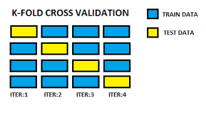
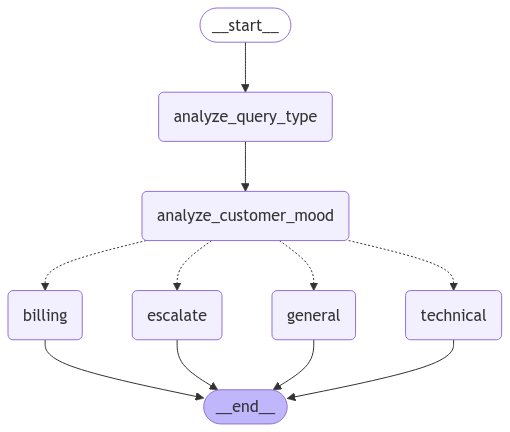


<!-- Beyond Stars -->

  
  

    <h3>Beyond Stars</h3>
    

      Beyond Stars is an interactive web app that lets users explore the night sky as seen from exoplanets. Using data from NASA's Gaia star catalog, the app provides a unique 3D view of stars and constellations from various exoplanetary perspectives. It also features an educational gaming mode to engage users in discovering celestial objects.
    

  

  <strong>Tech Stack</strong>
  <ul>
    <li><strong>Languages:</strong> Python, JavaScript, HTML/CSS</li>
    <li><strong>Frameworks &amp; Libraries:</strong> Three.js, WebGL</li>
    <li><strong>Tools:</strong> Figma (for UI/UX design)</li>
    <li><strong>Data Source:</strong> ESA Gaia DR3 Star Catalog</li>
  </ul>

  <a href="https://github.com/Kargichauhan/beyondthestars" style="padding: 10px 20px; background-color: #7d8085; color: white; text-decoration: none; border-radius: 5px; text-align: center; font-weight: bold; flex: 1;">GitHub</a>
  <a href="https://beyondstars.space" style="padding: 10px 20px; background-color: #7d8085; color: white; text-decoration: none; border-radius: 5px; text-align: center; font-weight: bold; flex: 1;">Website</a>
  <a href="https://www.canva.com/design/DAGSyNAtv2Q/10FhJ-Qr4NBaI6PKU76vDg/view" style="padding: 10px 20px; background-color: #7d8085; color: white; text-decoration: none; border-radius: 5px; text-align: center; font-weight: bold; flex: 1;">Demo</a>

<!-- UA Course Compass -->

  
  

    <h3>UA Course Compass</h3>
    

      UA Course Compass is a web-based software application designed to help students pursuing a Bachelor of Science in Information Science at the University of Arizona effectively manage their 4-year course plan. The platform provides personalized course recommendations, a four-year planning tool, interest surveys, and email reminders to streamline the academic planning process, leveraging machine learning and data scraping technologies to enhance the student experience.
    

  

  <strong>Tech Stack</strong>
  <ul>
    <li><strong>Languages:</strong> HTML, CSS, JavaScript</li>
    <li><strong>Frameworks &amp; Libraries:</strong> Node.js, Selenium</li>
    <li><strong>Database:</strong> PostgreSQL</li>
    <li><strong>Machine Learning:</strong> NLP algorithm for course recommendations</li>
    <li><strong>Other Tools:</strong> Email API for notifications, Data scraping from university course catalogs</li>
  </ul>

  <a href="https://github.com/rachelS485/ISTA-498-Capstone-Group-1" style="padding: 10px 20px; background-color: #7d8085; color: white; text-decoration: none; border-radius: 5px; text-align: center; font-weight: bold; flex: 1;">GitHub</a>
  <a href="https://www.canva.com/design/DAGDLihHpOY/iQS9LNLp3uMDeqHJTggxOw/view" style="padding: 10px 20px; background-color: #7d8085; color: white; text-decoration: none; border-radius: 5px; text-align: center; font-weight: bold; flex: 1;">Demo</a>

<!-- Autonomous Deep Space Exploration -->

  
  

    <h3>Autonomous Deep Space Exploration</h3>
    

      This project focuses on enabling deep space exploration using innovative system-of-systems architecture with small spacecraft inspectors. Leveraging machine learning for real-time decision-making, the project addresses the challenges of long-duration space missions, including navigation and communication limitations in harsh environments.
    

  

  <strong>Tech Stack</strong>
  <ul>
    <li><strong>Languages:</strong> Python</li>
    <li><strong>Frameworks:</strong> Machine Learning Algorithms for autonomous operation</li>
    <li><strong>Tools:</strong> Synthetic Data Generation, Hyperparameter Tuning</li>
    <li><strong>System Architecture:</strong> Multi-layered inspector satellite design</li>
  </ul>

  <a href="https://github.com/Kargichauhan/ml-main" style="padding: 10px 20px; background-color: #7d8085; color: white; text-decoration: none; border-radius: 5px; text-align: center; font-weight: bold; flex: 1;">GitHub</a>
  <a href="https://pdf.ac/220KBn" style="padding: 10px 20px; background-color: #7d8085; color: white; text-decoration: none; border-radius: 5px; text-align: center; font-weight: bold; flex: 1;">Demo</a>

<!-- Linear Regression and Cross Validation -->

  
  

    <h3>Linear Regression and Cross Validation</h3>
    

      This project focuses on implementing linear regression using matrix normal equations and performing cross-validation to assess model performance. The objective is to fit polynomial models to datasets and interpret regression outcomes. Python is used for building regression models, generating cross-validation results, and producing plots for data visualization.
    

  

  <strong>Tech Stack</strong>
  <ul>
    <li><strong>Languages:</strong> Python</li>
    <li><strong>Libraries:</strong> NumPy, Matplotlib</li>
    <li><strong>Tools:</strong> Cross-Validation, Linear Regression, Polynomial Regression</li>
  </ul>

  <a href="https://github.com/Kargichauhan/Linear-Regression-and-Cross-Validation-Implementation-for-Polynomial-Model-Fitting" style="padding: 10px 20px; background-color: #7d8085; color: white; text-decoration: none; border-radius: 5px; text-align: center; font-weight: bold; flex: 1;">GitHub</a>

<!-- Agentic Customer Support - Automating Customer Service Workflows -->

  
  

    <h3>Agentic Customer Support - Automating Customer Service Workflows</h3>
    

      This project focuses on building an intelligent customer support system that leverages LangGraph and OpenAI’s GPT API. The system automates query categorization, sentiment analysis, and response generation, while dynamically visualizing workflows for improved debugging and clarity. It includes mechanisms for escalating unresolved issues to human agents, ensuring a human-centric approach to customer service.
    

  

  <strong>Tech Stack</strong>
  <ul>
    <li><strong>Languages:</strong> Python</li>
    <li><strong>Libraries:</strong> LangGraph</li>
    <li><strong>APIs:</strong> OpenAI GPT API</li>
    <li><strong>Tools:</strong> Workflow Visualization, Sentiment Analysis</li>
  </ul>

  <a href="https://github.com/Kargichauhan/Agentic_customer_support" style="padding: 10px 20px; background-color: #7d8085; color: white; text-decoration: none; border-radius: 5px; text-align: center; font-weight: bold; flex: 1;">GitHub</a>

<!-- Mental Health Chatbot for Counselors – AI-Driven Mental Health Support -->

  
  

    <h3>Mental Health Chatbot for Counselors – AI-Driven Mental Health Support</h3>
    

      This project focuses on fine-tuning a LLaMA-3 model for mental health applications using <a href="https://unsloth.ai">Unsloth</a>, an optimized framework for training large language models efficiently. It implements <a href="https://github.com/artidoro/qlora">QLoRA</a> for memory-efficient training and is deployed on Hugging Face for real-time interaction using <a href="https://www.hume.ai">HumeAI</a>. The system provides counselors with a reliable, empathetic tool to support mental health care.
    

  

  <strong>Tech Stack</strong>
  <ul>
    <li><strong>Languages:</strong> Python</li>
    <li><strong>Libraries:</strong> QLoRA, Unsloth</li>
    <li><strong>APIs:</strong> HumeAI</li>
    <li><strong>Tools:</strong> Hugging Face</li>
  </ul>

  <a href="https://github.com/Kargichauhan/mental-health-app" style="padding: 10px 20px; background-color: #7d8085; color: white; text-decoration: none; border-radius: 5px; text-align: center; font-weight: bold; flex: 1;">GitHub</a>
  <a href="https://mentalhealthcare-yceuaojkfxaf9u4vxlgbdk.streamlit.app" style="padding: 10px 20px; background-color: #7d8085; color: white; text-decoration: none; border-radius: 5px; text-align: center; font-weight: bold; flex: 1;">Try here!</a>

<!-- OutfitEquation – Agent-Based Fashion Recommendation System -->

  
  

    <h3>OutfitEquation – Agent-Based Fashion Recommendation System</h3>
    

      This project focuses on developing an agent-based fashion recommendation system that leverages the <a href="https://huggingface.co/datasets/Marqo/polyvore">Polyvore</a> dataset and the <a href="https://www.pinai.io">PinAI API</a> for data retrieval. It delivers personalized outfit suggestions based on skin tone, budget, and past inspirations, offering real-time style-based recommendations for users.
    

  

  <strong>Tech Stack</strong>
  <ul>
    <li><strong>Languages:</strong> Python</li>
    <li><strong>Datasets:</strong> Polyvore</li>
    <li><strong>APIs:</strong> PinAI API</li>
    <li><strong>Tools:</strong> Agent-based Modeling</li>
  </ul>

  <a href="https://github.com/Kargichauhan/Wadrobe_/tree/main" style="padding: 10px 20px; background-color: #7d8085; color: white; text-decoration: none; border-radius: 5px; text-align: center; font-weight: bold; flex: 1;">Code</a>
  <a href="https://wardroberecommender-lnq9k62gst4yh8hzv7xgy3.streamlit.app" style="padding: 10px 20px; background-color: #7d8085; color: white; text-decoration: none; border-radius: 5px; text-align: center; font-weight: bold; flex: 1;">Try here!</a>

---

### Next Project
{: style="float: left; width: 200px; height: 200px; object-fit: cover; border-radius: 5px; margin-right: 20px;"} 
Stay tuned for an exciting new project!