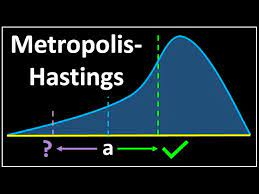

## Beyond Stars!
[Beyond Stars](image02.png)

**Beyond Stars** is an interactive web app that lets users explore the night sky as seen from exoplanets. Using data from NASA's Gaia star catalog, the app provides a unique 3D view of stars and constellations from various exoplanetary perspectives. It also features an educational gaming mode to engage users in discovering celestial objects.

### Tech Stack
- **Languages:** Python, JavaScript, HTML/CSS
- **Frameworks & Libraries:** Three.js, WebGL
- **Tools:** Figma (for UI/UX design)
- **Data Source:** ESA Gaia DR3 Star Catalog

#### Links
- [GitHub Repository](https://github.com/Kargichauhan/beyondthestars)
- [Website](https://beyondstars.space)
- [Demo](https://www.canva.com/design/DAGSyNAtv2Q/10FhJ-Qr4NBaI6PKU76vDg/view)

---

## UA Course Compass

**UA Course Compass** is a web-based software application designed to help students pursuing a Bachelor of Science in Information Science at the University of Arizona effectively manage their 4-year course plan. The platform provides personalized course recommendations, a four-year planning tool, interest surveys, and email reminders to streamline the academic planning process, leveraging machine learning and data scraping technologies to enhance the student experience.

### Tech Stack
- **Languages:** HTML, CSS, JavaScript
- **Frameworks & Libraries:** Node.js, Selenium
- **Database:** PostgreSQL
- **Machine Learning:** NLP algorithm for course recommendations
- **Other Tools:** Email API for notifications, Data scraping from university course catalogs

#### Links
- [GitHub Repository](https://github.com/rachelS485/ISTA-498-Capstone-Group-1)
- [Demo](https://www.canva.com/design/DAGDLihHpOY/iQS9LNLp3uMDeqHJTggxOw/view)

---

## Autonomous Deep Space Exploration

This project focuses on enabling deep space exploration using innovative system-of-systems architecture with small spacecraft inspectors. Leveraging machine learning for real-time decision-making, the project addresses the challenges of long-duration space missions, including navigation and communication limitations in harsh environments.

### Tech Stack
- **Languages:** Python
- **Frameworks:** Machine Learning Algorithms for autonomous operation
- **Tools:** Synthetic Data Generation, Hyperparameter Tuning
- **System Architecture:** Multi-layered inspector satellite design

#### Links
- [GitHub Repository](https://github.com/Kargichauhan/ml-main)
- [Demo](https://pdf.ac/220KBn)

---

## Linear Regression and Cross Validation

This project focuses on implementing linear regression using matrix normal equations and performing cross-validation to assess model performance. The objective is to fit polynomial models to datasets and interpret regression outcomes. Python is used for building regression models, generating cross-validation results, and producing plots for data visualization.

### Tech Stack
- **Languages:** Python
- **Libraries:** NumPy, Matplotlib
- **Tools:** Cross-Validation, Linear Regression, Polynomial Regression

#### Links
- [GitHub Repository](https://github.com/Kargichauhan/Linear-Regression-and-Cross-Validation-Implementation-for-Polynomial-Model-Fitting)

---

## Metropolis Hastings

This project involves using the Metropolis-Hastings MCMC algorithm to infer 3D line parameters from noisy 2D image projections. By leveraging the pinhole camera model, the project generates visualizations of projected points and explores the impact of cross-camera projections, all while sampling from posterior distributions.

### Tech Stack
- **Languages:** Python
- **Frameworks & Libraries:** NumPy, SciPy, Matplotlib
- **Algorithms:** Metropolis-Hastings MCMC
- **Tools:** Pinhole Camera Model, Posterior Sampling, 2D Image Projections

#### Links
- [GitHub Repository](https://github.com/Kargichauhan/Metropolis---Hastings-MCMC-Inference-of-3D-Line/tree/main/Metropolis%20-%20Hastings%20MCMC%20Inference%20of%203D%20Line)

---

## Next Project

Stay tuned for an exciting new project!
